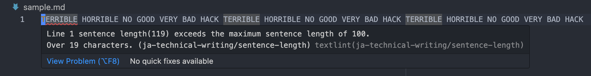

# Template project for technical writing

## Requirements

- Docker Desktop
- VSCode

## Get started

1. Clone this repository.
2. Open the project in VSCode.
3. Open VSCode Command Pallet, then type "Reopen in Container".
4. Select it and VSCode will reopen the project in Container.
5. That's it!

## How it works

If you violet [textlint](https://textlint.github.io/) rules or make a typo by mistake, VSCode will warn it immediately.
Here is an example.

